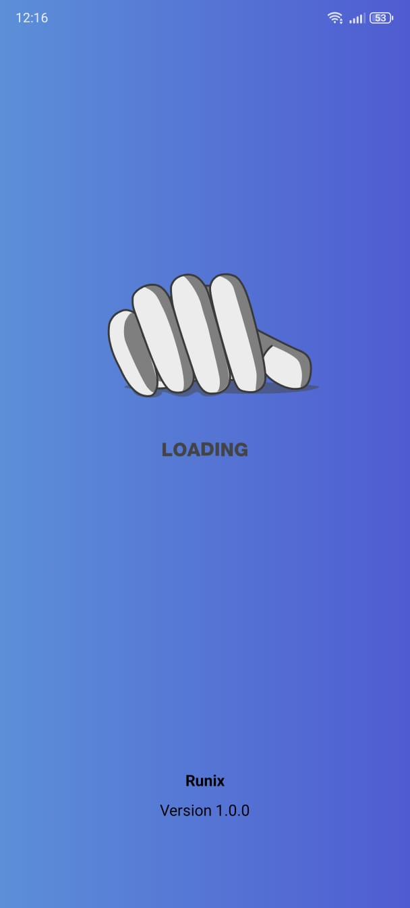

# Runner Fitness Tracker


### 🏁 Splash Screen

<div>
  
  
  
  
</div>
### 🏁 Splash Screen

<div>
  
  
  
  
</div>
This Android app is designed specifically for runners to **track their training sessions**, **set fitness goals**, and **view workout history**. It also includes **motivational phrases** to keep you inspired and engaged throughout your journey.

> 🟢 **Note:** The app is available in **both English and Spanish**, and automatically adapts to the user's device language settings. It also supports both **light and dark mode** for a modern user experience.

## 🏃 Features:
- **Splash Screen**: A brief loading screen shown on app launch.
- **User Registration**: Users can enter and save their name for a personalized experience.
- **Set Goals**: Define and update running goals such as distance or time targets.
- **Track Workouts**: Log training sessions with key details like date, distance, time, and type.
- **Workout History**: View and manage past running sessions.
- **Motivational Quotes**: Get a random motivational phrase to stay inspired.
- **Progress Dashboard**: Visual progress bar and confetti animation when a goal is achieved.
- **Multi-language Support**: 🌐 App is available in **English and Spanish**.
- **Theme Support**: 🌗 Supports both **light and dark mode**.

## 📱 Activities:
- **SplashActivity**: Initial splash screen on app launch.
- **MainActivity**: Input user name and navigate to dashboard.
- **GoalActivity**: Set or update fitness goals.
- **RegisterActivity**: Log running sessions with complete details.
- **HistoryActivity**: View a list of previous workouts.
- **MotivationActivity**: Display a random motivational phrase.
- **DashboardActivity**: Main screen to track progress, access features, and log out.

## 📋 Requirements:
- Android Studio
- Minimum SDK: Android 5.0 (Lollipop)

## Setup:


1. Clone the repository:
   ```bash
   git clone https://github.com/yourusername/runner-fitness-tracker.git
   
2.Open the project in Android Studio.

3.Run the app on an emulator or physical device.


## 📦 Release

A compiled APK version of the app is available for download in the [Releases](https://github.com/kelvinhe04/Runner-App-SoftVII-Parcial-2/releases) section of this repository for easy installation on Android devices.

